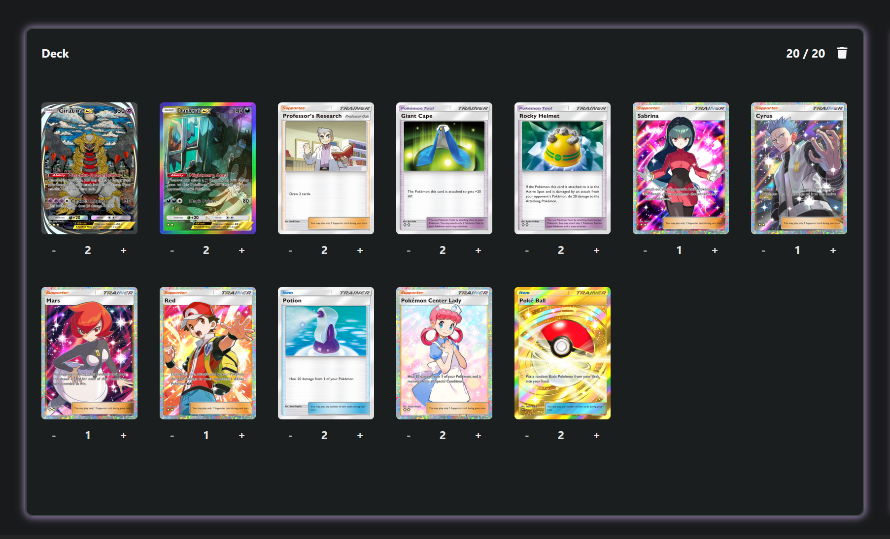
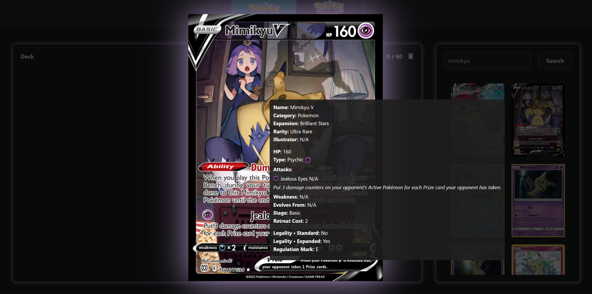
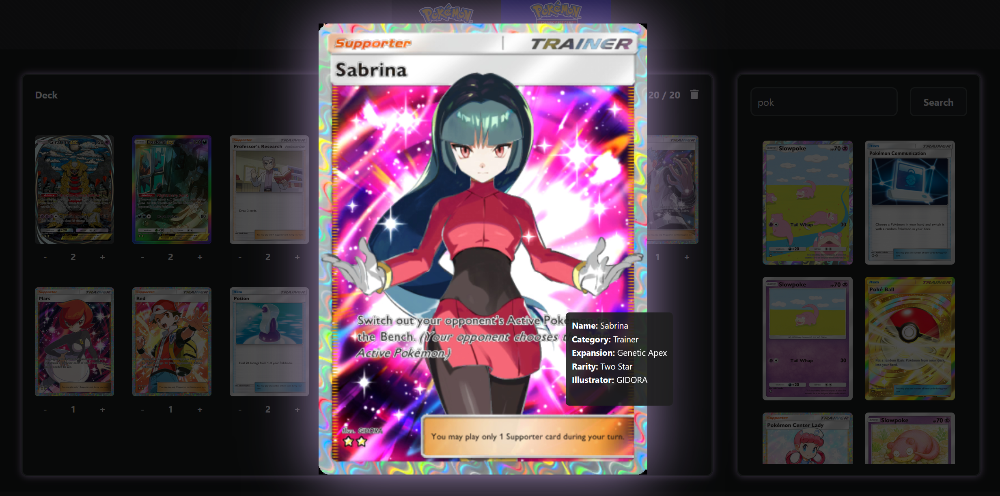
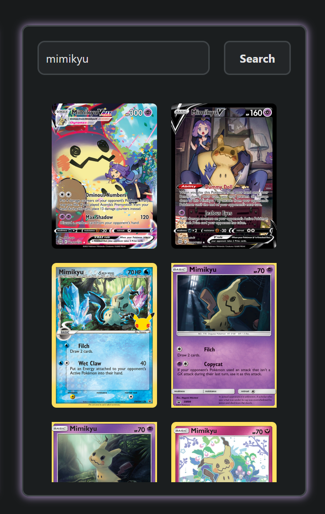
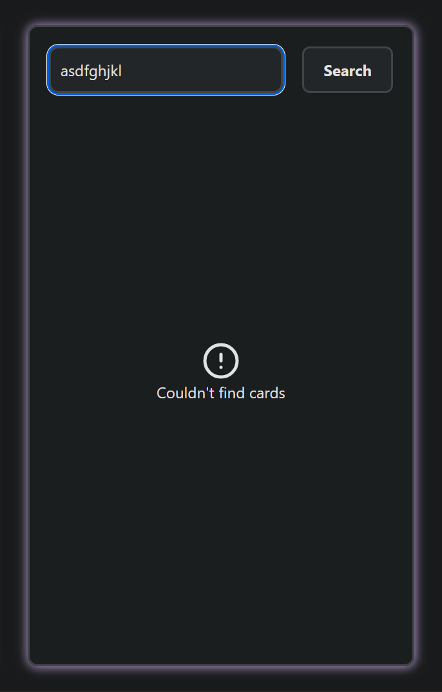
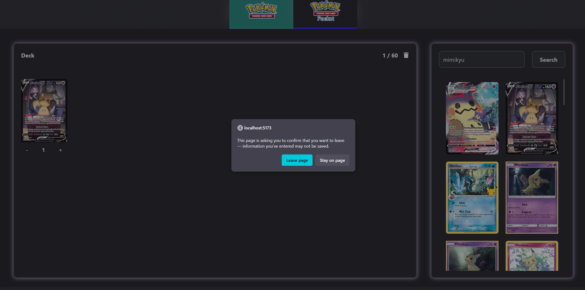

# PTCG Deck Builder

PTCG Deck Builder is a web application designed to simplify deck building for Pokémon TCG and Pokémon TCG Pocket. Future updates will include support for Magic The Gathering (MTG).

The app allows users to perform filtered and detailed searches for cards, helping to construct decks that comply with official rules for both casual and competitive play. Card data is sourced from the Pokémon API, ensuring that sets are always up-to-date and legality rules reflect the latest changes.

## Features (In Progress)
- Search and filter Pokémon cards by type, set, and other attributes.
- Build decks while following official legality rules.
- Real-time updates from the Pokémon API.
- Future plans: support for additional TCGs (e.g., MTG).

## Status
- Work in progress – features and UI are under active development.

# DEMO

This is a demo showcase of a project currently in development.

The project currently supports both **Pokémon TCG** and **Pokémon Pocket**, with all card data fetched from the **TCGdex API**.

### Deck Building

At this stage, the **deck-building system** is fully functional. Cards can be **added or removed** by either **dragging them** into the deck area or **clicking them** directly from the search list.
Validation rules ensure that decks are built according to the official game rules:

* **Pokémon Pocket**: up to **2 copies** of a card with the same name (different artworks allowed), and a **maximum of 20 cards** per deck.
* **Pokémon TCG**: up to **4 copies** of a card with the same name (different artworks allowed), and a **maximum of 60 cards** per deck.

And a dedicated **“Clear Deck”** sticky button allows users to remove all cards at once.

### Card Detail:

Cards can also be viewed in **high definition** via an overlay. Hovering over a card shows a **tooltip** with detailed information, dynamically adjusted based on the **game type** and **card type** (e.g., Pokémon or Trainer).
Card details can be accessed either by **right-clicking a card** in the search results or by **clicking it directly** in the deck list.

### Search & Filter:

Currently, the **search function** supports lookups by **card name only**; more advanced filtering options are under development.
Error handling has already been fully implemented.

### Deck Session Management:

If a deck-building session is in progress, users will receive a **warning prompt** before leaving the page, reminding them that unsaved changes will be lost.
A similar **warning still needs to be implemented** for when users **switch between game modes**, to prevent accidental loss of deck progress.

### Video

#### Additional Info:

The **UI design** is still being defined. There is **no mobile support yet**, though the layout is **responsive on desktop**.
Mobile compatibility and a potential **installable app version** are planned for future updates.